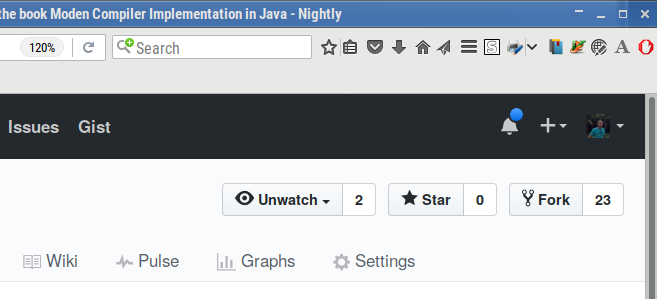
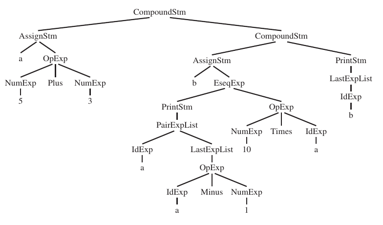

% The straightline programming language

# Straightline

**Straightline** is a micro programming language used in the book series _Modern Compiler Implementation_ by Andrew Appel.

# Working with git repositories

## Initial setup to work with the straightline project in BCC328

In order to develop the activities of the BCC328 (Compiler Construction 1) course you should:

- Have a [github](https://github.com/) account. If you do not have one, visit the github site and [sign up](https://github.com/join).
- [Log in](https://github.com/login) to github.
- Visit the main [straightline](https://github.com/romildo/straightline) project page.
- Fork the straightline project. For that use the `Fork` buttom at the top right of the project page.
    
  This will create your own copy of the main repository. It can be freely modified by you. But probably you do not have permission to modify the main repository.
- In your computer clone your fork of the straightline project. Notice that in the commands that follow any text written between angular brackets `<>` shold be replaced by more appropriate text, according to your setup. For instance `<working directory` should be replaced by the name of the directory (folder) for the working activities.
```
$ cd <working directory>
$ git clone https://github.com/<owner>/straightline.git
$ cd straightline
```
- Set the the upstream remote repository for your clone. The upstream remote repository is the main repository of the project from which the fork was made.
```
$ git remote add upstream https://github.com/romildo/straightline.git
```
All remote repositories can be listed with the following command:
```
$ git remote -v
```

Similar steps will also be followed when starting other github based projects on the course.

The above commands were presented to you using the command line. There are other ways to accomplish them, though. For instance they may be integrated in development environments like IntelliJ IDEA and Eclipse.

## When testing a version of the straightline compiler

- Change your working directory to the folder containing your clone.
```
$ cd <working directory>/straightline
```
- Select the master branch of the clone of your forked project.
```
$ git branch
$ git checkout master
```
- Pull the latest changes from the remote repository.
```
$ git pull upstream master
```
- Create and select the appropriate branch for the activity.
```
$ git checkout -b <activity>
```
- Use the project code to do whatever is needed.

## To submit an activity

- Select the master branch of the clone of your forked project.
```
$ cd <working directory>/straightline
$ git checkout master
```
- Pull the latest changes from the remote repository.
```
$ git pull upstream master
```
- Create a new branch where you will develop the activity.
```
$ git checkout -b <activity>
```
- Develop the activity.
- Check the status of your cloned repository:
```
git status
```
This command list new and modified files.

- Add any new or modified file of interest to the revision history:
```
git add <files>
```
- Commit the changes:
```
git commit -m <message>
```
- Push your changes to your forked project.
```
git push origin <activity>
```
- Make a pull request (PR) from your forked project at github.

# Compiling with maven

## To remove the generated files

```
$ mvn clean
```

## To compile the project

```
$ mvn compile

```

## To make a `jar` file of the project

```
$ mvn package
```


# Grammar

- The syntax of the language is given by a context free grammar.
- Only the production rules are explicitly given.
- The sets of terminals and non-terminals are obtained from the rules.
- The initial symbol is the non-terminal on the left side of the first production rule.

Production rule                   | Internal representation
----------------------------------|-------------------------
_Stm_ → _Stm_ `;` _Stm_           | CompoundStm
_Stm_ → `id` `:=` _Exp_           | AssignStm
_Stm_ → `print` `(` _ExpList_ `)` | PrintStm
_Exp_ → `id`                      | IdExp
_Exp_ → `num`                     | NumExp
_Exp_ → _Exp_ _Binop_ _Exp_       | OpExp
_Exp_ → `(` _Stm_ `,` _Exp_ `)`   | EseqExp
_ExpList_ → _Exp_                 | LastExpList
_ExpList_ → _Exp_ `,` _ExpList_   | PairExpList
_Binop_ → `+`                     | Plus
_Binop_ → `-`                     | Minus
_Binop_ → `*`                     | Times
_Binop_ → `/`                     | Div

# Example

```
a := 5 + 3;
b := ( print(a, a - ), 10*a);
print(b)

```



## General guidelines for building the AST

- There is a class for each interesting non terminal (representing a kind of phrase).
- There is a subclass for each production rule for that non terminal (representing a particular form for the phrase).

For instance, the _Stm_ non terminal represents statements. So there is an abstract class, named `Stm` to represent all forms of statements. But there are three forms of statements, and for each one there is a subclass of `Stm`:

- compound statements, represented by the `Compoundstm` class
- assignment statements, represented by the `AssignStm` class
- print statements, represented by the `PrintStm`class

# Activities

## Building an abstract syntax tree

Add a `Main` class to the project, with a `main` method that creates the AST for the program given above, and print it.

As an example, below is the AST for the program:

```
x := 2 + 3 * 4;
print(a)
```

``` java
Stm p = new CompoundStm(new AssignStm("x",
                                      new OpExp(new NumExp(2),
                                                new OpExp(new NumExp(3),
                                                          new NumExp(4),
                                                          OpExp.Op.TIMES),
                                                OpExp.Op.PLUS)),
                        new PrintStm(List.of(new IdExp("x"))));
```

## Pretty printing the AST

Make `AST` implement the interface `javaslang.render.ToTree<String>` from the `javalang-render` library. This will allow converting the AST to general trees of `String` that can be easily drawn in different ways.

1. Add the `implements` clause to the class declaration of `AST`.
2. Implement the method `toTree` in each concrete subclass of `AST`. It has no arguments and returns a `javaslang.collection.Tree.Node<String>` corresponding to the AST.
3. Test with the AST written previously, drawing it in the terminal.

## Calculating the maximum number of arguments in print statements

Add a method `maxargs` to calculate the maximum number of arguments in print statements ocurring in a given program.

It should have no arguments and returns an `int`.

Test with the AST you have created above.

## Interpreting

Add a method `interp` to run a program.

It should have a `Map<String, Integer>` as argument representing the memory, and runs the program.

The memory can be a hash table where the keys are variable names, and the associated values are the value of the variable.

Test with the AST you have created above.

## Write test units for the project

Write the class `MainTest` in the directory `test/java` to test the interpreter.
