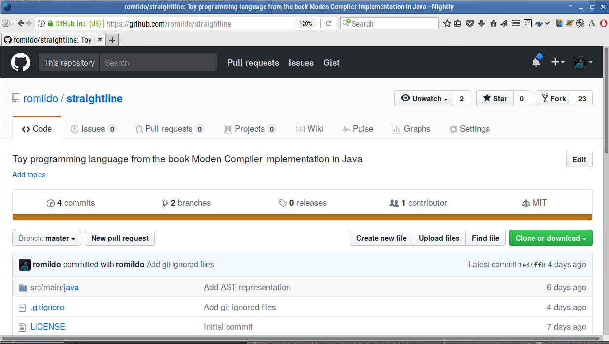

# Straightline

Straightline é uma micro linguagem de programação usada na série de
livros _Modern Compiler Implementation_ escritos por Andrew Appel.

# Gramática

Stm → Stm ; Stm (CompoundStm)
Stm → id := Exp (AssignStm)
Stm → print ( ExpList ) (PrintStm)

Exp → id (IdExp)
Exp → num (NumExp)
Exp → Exp Binop Exp (OpExp)
Exp → ( Stm , Exp ) (EseqExp)

ExpList → Exp (LastExpList)
ExpList → Exp , ExpList (PairExpList)

Binop → + (Plus)
Binop → − (Minus)
Binop → × (Times)
Binop → / (Div)

# Practice

## Initial setup to work with Straighline in BCC328

In order to develop the activities of the BCC328 (Compiler Construction) course you should:

- Have a [github](https://github.com/) account. If you do not have one, visit the github site and [sign up](https://github.com/join).
- [Log in](https://github.com/login) the github.
- Visit the [Straighline](https://github.com/romildo/straighline) project page.
- Fork the Straighline project.

- In your computer clone your fork of the straighline project. Notice that in the commands that follow any text written between angular braces `<>` shold be replaced by an appropriate text. For instance `<working directory` should be replaced by the name of directory (folder) for working activities.
```
$ cd <working directory>
$ git clone https://github.com/romildo/straighline.git
$ cd straighline
```
- Set the remote repository for your clone
```
$ git remote add upstream https://github.com/romildo/straighline.git
$ git remote -v
```

## When testing a version of the straighline compiler

- Change your working directory to the folder containing your clone.
```
$ cd <working directory>
```
- Select the master branch of the clone of your forked project.
```
$ git branch
$ git checkout master
```
- Pull the latest changes from the remote repository.
```
$ git pull upstream master
```
- Select the appropriate branch for the activity.
```
$ git checkout -b <activity>
```
- Develop the activity.

## To submit an activity

- Select the master branch of the clone of your forked project.
```
$ cd <working directory>
$ git checkout master
```
- Pull the latest changes from the remote repository.
```
$ git pull upstream master
```
- Create a new branch where you will develop the activity.
```
$ git checkout -b <activity>
```
- Develop the activity.
- See the status of your cloned repository:
```
git status
```
- Add any new or modified file to the revision history:
```
git add <files>
```
- Commit the changes:
```
git commit -m <message>
```
- Push your changes to your forked project.
```
git push origin <activity>
```
- Make a pull request (PR) from your forked project at github.

## Some useful commands

### To remove the generated files 

```
$ mvn clean
```

### To compile the project

```
$ mvn compile

```

### To make `jar` files of the project

```
$ mvn package
```
